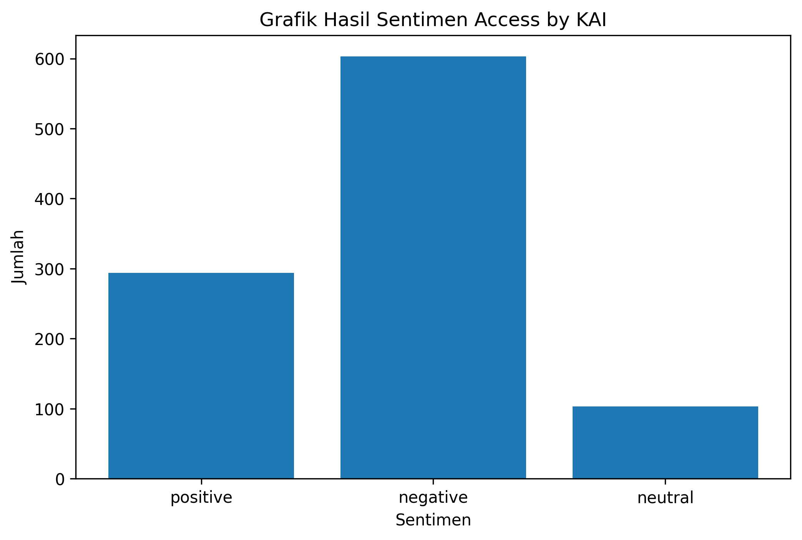

# Analisis Sentimen Access by KAI

## UTS_Big-Data

**Nama:** Nisrina Salsabila  
**NIM:** 14022300048  
**Prodi:** Sistem Informasi  

## Deskripsi Project
Project ini berisi analisis sentimen komentar pengguna aplikasi Access by KAI dari Google Play Store.

## Dataset
Data diperoleh menggunakan library `google-play-scraper`.

**Jumlah data:** 1000 komentar.

## Kolom Dataset
- **userName**: nama pengguna
- **score**: rating pengguna
- **at**: tanggal ulasan
- **content**: isi komentar
- **sentimen**: hasil klasifikasi sentimen
- **confidence**: tingkat keyakinan model

## Metode Analisis
Analisis sentimen dilakukan menggunakan pendekatan **Natural Language Processing (NLP)** dengan model **IndoRoBERTa** dari Wilson Wongso.

**Model yang digunakan:**

`w11wo/indonesian-roberta-base-sentiment-classifier`

Model ini mengklasifikasikan komentar menjadi:
- positive
- negative
- neutral

## Hasil Count Sentimen

| Sentimen | Jumlah | Persentase |
|----------|--------|------------|
| Positive | 294 | 29.4% |
| Negative | 603 | 60.3% |
| Neutral  | 103 | 10.3% |

## Grafik Hasil Sentimen

## Kesimpulan
Berdasarkan hasil analisis terhadap 1000 komentar pengguna Access by KAI, sentimen dengan jumlah terbanyak adalah **negative** yaitu sebanyak **603 komentar** atau **60.3%**.

Hasil ini menunjukkan bahwa komentar pengguna terhadap aplikasi Access by KAI memiliki kecenderungan sentimen **negative**. Analisis ini dapat digunakan untuk melihat gambaran umum kepuasan dan keluhan pengguna terhadap aplikasi.

## Tools
- Google Colab
- Python
- Pandas
- Transformers
- Torch
- Matplotlib
- Google Play Scraper
